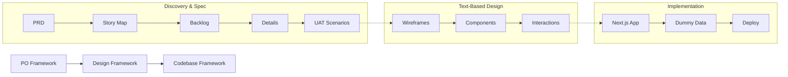

# AI-Ready Product Workflow

> **From Idea to Implementation.** A structured, AI-optimized automation framework for building software products.


## 🚀 Overview

The **AI-Ready Product Workflow** is a comprehensive system designed to streamline the entire product development lifecycle. It bridges the gap between vague ideas and working code through three specialized frameworks:

1.  **PO Framework:** Specifications & Requirements (5 Stages)
2.  **Design Framework:** Text-based UI/UX Design (3 Stages)
3.  **Codebase Framework:** Rapid Implementation (Next.js + ShadCN)

**Philosophy:** structured inputs + AI-friendly formats = predictable, high-quality outputs.

---

## 🔄 The End-to-End Workflow

The framework enforces a linear, traceable path from discovery to deployment:



---

## 1️⃣ PO Framework (Product Owner)

**Purpose:** Translate vision into detailed, testable specifications.

| Stage | Artifact | Description |
|-------|----------|-------------|
| **1. PRD** | `prd.md` | **Product Requirements Document.** The "Why" and "What". Problem, goals, and success metrics. |
| **2. USM** | `usm.md` | **User Story Map.** Visualizing high-level user activities and steps. |
| **3. USL** | `usl.md` | **User Story List.** Prioritized backlog (MoSCoW) for planning. |
| **4. USD** | `usd/*.md` | **User Story Details.** Acceptance criteria (AC) for every story. **Validation Source.** |
| **5. UAT** | `uat/*.md` | **User Acceptance Tests.** BDD (Given/When/Then) scenarios defining "Done". |

👉 **[Explore PO Framework](./po-framework/README.md)**

---

## 2️⃣ Design Framework

**Purpose:** Create complete UI/UX specifications using **text and ASCII**, enabling AI-assisted design without visual tools.

| Stage | Artifact | Description |
|-------|----------|-------------|
| **1. Wireframes** | `WF-XXX` | Text descriptions + ASCII layouts. Maps directly to Acceptance Criteria. |
| **2. Components** | `COMP-XXX` | **ShadCN UI** component selection, props, states, and **TanStack Table** configs. |
| **3. Interactions** | `INT-XXX` | ASCII state diagrams showing user flows, error handling, and logic. |

**Key Features:**
*   **No Figma needed:** Design purely in Markdown.
*   **Traceable:** Every element links back to a User Story.
*   **Accessibility:** WCAG AA compliance built-in.

👉 **[Explore Design Framework](./design-framework/README.md)**

---

## 3️⃣ Codebase Framework

**Purpose:** Rapidly build deployable MVPs using a modern, standardized stack.

**The Stack:**
*   **Framework:** Next.js 16 (App Router)
*   **Styling:** TailwindCSS v4 + ShadCN UI
*   **State:** React Context (Zero dependencies)
*   **Data:** Dummy JSON (No backend required)

| Component | Description |
|-----------|-------------|
| **Dummy Data** | Build full UIs with local JSON files (`data/*.json`) before investing in a real backend. |
| **Patterns** | Pre-defined patterns for forms, tables, modals, and layouts. |
| **Testing** | Convert UAT specs directly into **Playwright** E2E tests. |

👉 **[Explore Codebase Framework](./codebase-framework/README.md)**

---

## 📂 Repository Structure

```
/
├── po-framework/           # rules, templates, and guides for PO work
├── design-framework/       # rules, text-based design system, and templates
├── codebase-framework/     # implementation guides, architectural patterns
├── features/               # ACTUAL PROJECT WORK (Feature Specs & Code)
└── README.md               # This file
```

---

## 🚀 Getting Started

### 1. Define a Feature
Start in the **PO Framework**. Create a folder in `features/{your-feature}/po/` and define your PRD.

### 2. Design the UI
Move to **Design Framework**. Using your ACs, create text wireframes in `features/{your-feature}/design/`.

### 3. Build & Deploy
Initialize your Next.js app in `features/{your-feature}/code/` following the **Codebase Framework** guidelines.

---

## 📝 License

**Proprietary License - All Rights Reserved**

```
Copyright © 2026 Karl Nguyen
All Rights Reserved.

This Automation Framework and its contents are proprietary and confidential.
Unauthorized copying, distribution, modification, or use is strictly prohibited
without explicit written permission from the copyright holder.
```
