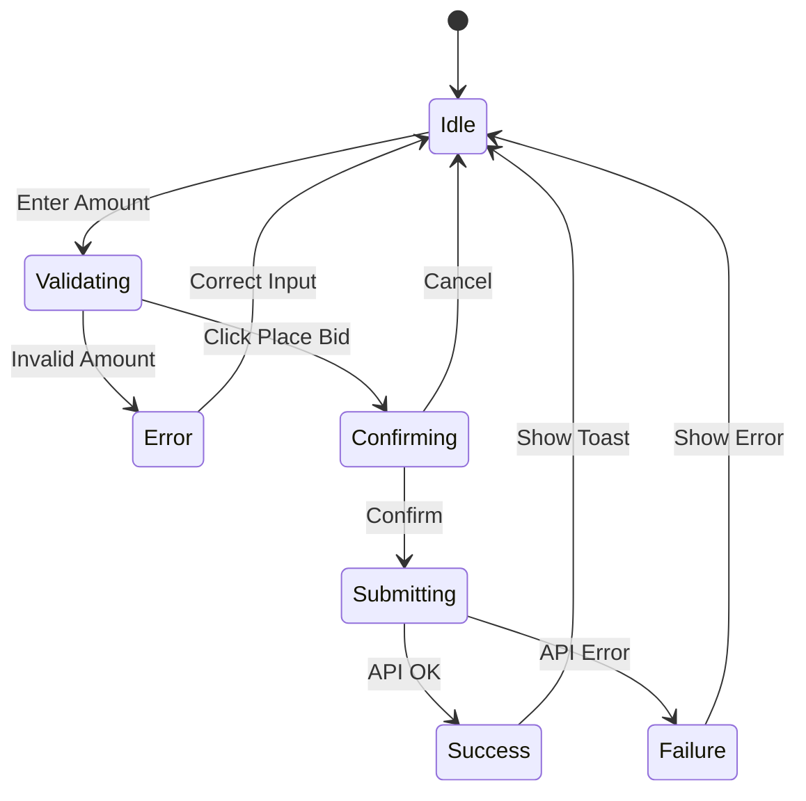

# Interaction Flow: Place Bid

**Flow ID:** FLOW-001
**Feature:** Container Auction
**Story ID(s):** US-008
**Wireframe ID(s):** WF-002
**Created:** 2024-05-21
**Last Updated:** 2024-05-21

---

## 1. Flow Overview

### Goal
Allow a buyer to successfully place a bid on an active listing.

### Trigger
User clicks the "Place Bid" button on the Listing Detail page.

### Preconditions
- User is logged in as "Buyer".
- Listing is "Active".
- Auction time has not expired.
- User is not the owner of the listing.

### Postconditions
- **Success:** Bid is recorded, Current Price updates, User sees success message.
- **Failure:** Error message displayed, Bid not recorded.

---

## 2. Step-by-Step Flow

| Step | Actor | Action | System Response | UI State Change |
| :--- | :--- | :--- | :--- | :--- |
| 1 | User | Enters bid amount in input field | Validates format (number) | Input field shows value |
| 2 | User | Clicks "Place Bid" button | Checks if amount >= Minimum Bid | Button shows loading state |
| 3 | System | (Validation) | If invalid: Returns error | Show inline error "Bid too low" |
| 4 | System | (Validation) | If valid: Opens confirmation modal | Modal appears |
| 5 | User | Clicks "Confirm Bid" in modal | Sends API request to place bid | Modal buttons disabled, spinner |
| 6 | System | (Processing) | Updates listing price, adds bid history | - |
| 7 | System | (Response) | Returns success | Modal closes, Toast "Bid Placed!" |
| 8 | System | (Update) | Refreshes Bid History table | Table shows new bid at top |

---

## 3. Alternative Paths / Edge Cases

### A. Bid is too low
- **Step 3:** System detects amount < (Current Price + Increment).
- **Response:** Show error "Minimum bid is €X".
- **Next:** User must increase amount.

### B. Auction Ended while bidding
- **Step 6:** System checks time. If expired -> Error.
- **Response:** Show error "Auction has ended".
- **Next:** Refresh page to show "Ended" state.

### C. Outbid immediately (Concurrency)
- **Step 6:** Another user placed a higher bid just before.
- **Response:** Show error "Price has updated. Minimum bid is now €Y".
- **Next:** Refresh current price.

---

## 4. State Diagram (Mermaid)

