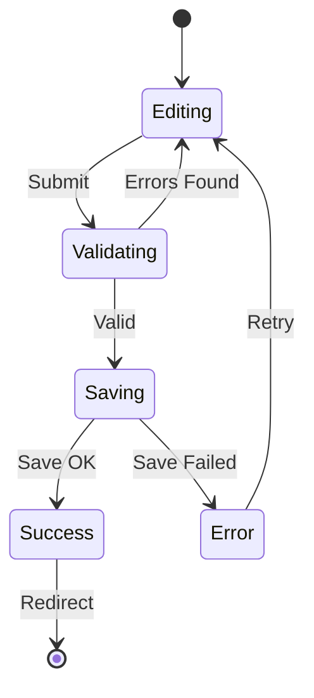

# Interaction Flow: Create Listing

**Flow ID:** FLOW-002
**Feature:** Container Auction
**Story ID(s):** US-004
**Wireframe ID(s):** WF-004
**Created:** 2024-05-21
**Last Updated:** 2024-05-21

---

## 1. Flow Overview

### Goal
Allow a seller to publish a new container listing to the marketplace.

### Trigger
User clicks "Create Listing" from the Dashboard.

### Preconditions
- User is logged in as "Seller".

### Postconditions
- **Success:** New listing is created in "Active" state, User redirected to Dashboard.
- **Failure:** Form errors displayed.

---

## 2. Step-by-Step Flow

| Step | Actor | Action | System Response | UI State Change |
| :--- | :--- | :--- | :--- | :--- |
| 1 | User | Navigates to Create Listing page | Loads empty form | Form displayed |
| 2 | User | Fills required fields (Type, Condition, Price) | Validates on blur/change | Field validation status updates |
| 3 | User | Enters Image URL | Fetches image preview (optional) | Preview box shows image |
| 4 | User | Clicks "Create Listing" | Validates all fields | Button shows loading state |
| 5 | System | (Validation) | If invalid: Focus first error | Show error messages |
| 6 | System | (Processing) | If valid: Saves listing to store | - |
| 7 | System | (Response) | Returns success | Redirects to Dashboard |
| 8 | System | (Notification) | Shows success toast | Toast "Listing Created Successfully" |

---

## 3. Alternative Paths / Edge Cases

### A. Validation Errors
- **Step 5:** Required fields missing.
- **Response:** Highlight fields in red, show "Required" text.
- **Next:** User fixes errors and resubmits.

### B. Invalid Image URL
- **Step 3:** User enters broken link.
- **Response:** Preview shows "Image not found" placeholder.
- **Next:** User corrects URL.

---

## 4. State Diagram (Mermaid)

